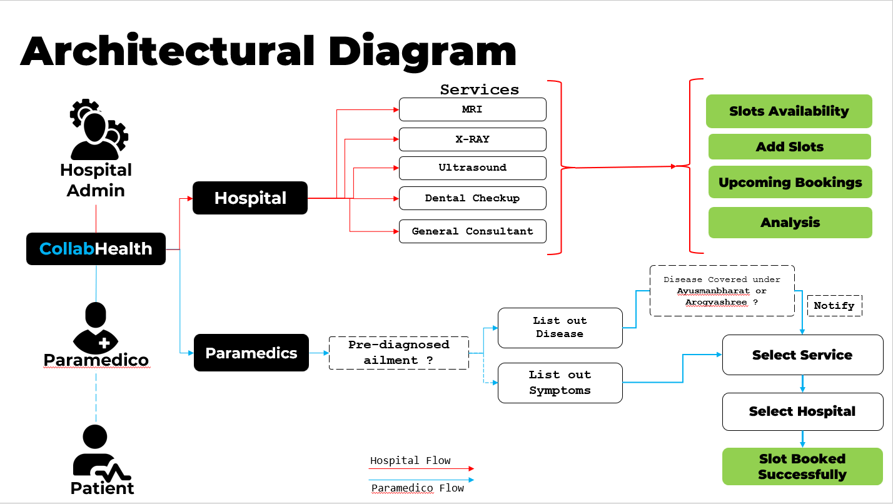

# JPMC Hackathon : CODE for GOOD 2022

## CollabHealth

### Problem Statement:
* Dakshas Foundation helps marginalized patients get non-emergency medical treatment. 
* Daksha's Organization is looking for a healthcare service aggregator that aggregates the dispersed, unused healthcare capacity 
* The unmet demand of the whole sector which can then help match a marginalized patient's healthcare needs and a healthcare asset's unused capacity.

### Solution:

* A web Application where Paramedical staff can engage , track Unused healthcare capacitors and book slots for the Patient if any slots are available 
* Interface where Hospitals can list their unused resources, with analysis of available slots for the various healthcare services 
* Constant Booking & Updation of the slots in the same portal

### Architectural Diagram
<kbd>

</kbd>

### Application Interface:
<kbd>

</kbd>

<kbd>

</kbd>

<kbd>

</kbd>

<kbd>

</kbd>

## Tech Stack used in building CollabHealth:
### FrontEnd :    
### Designing : 
### Database : 
### Backend:  

### Documentation:  

